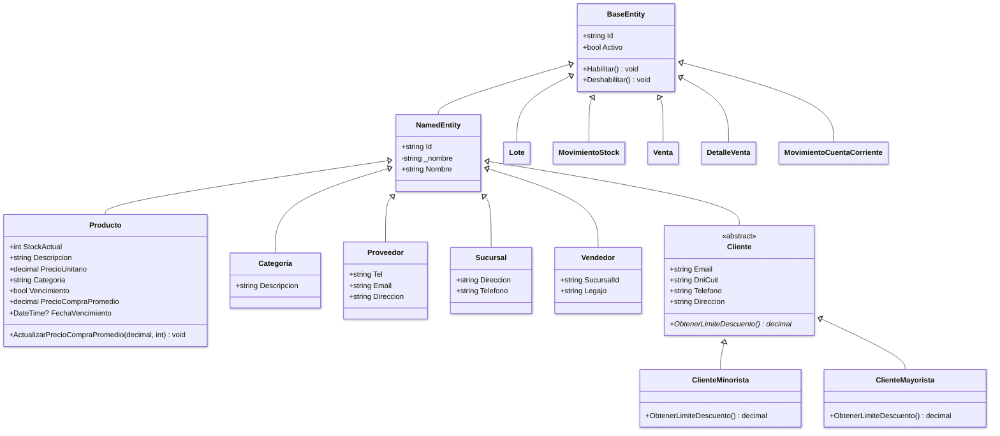
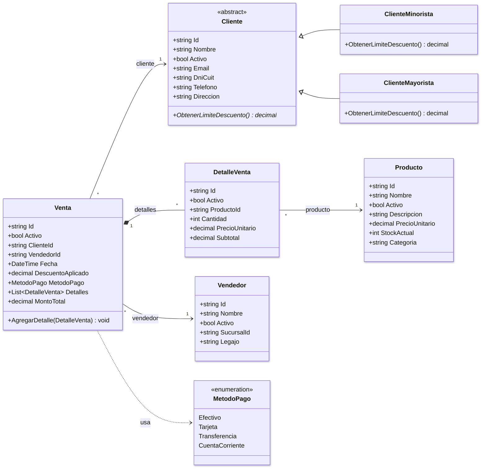
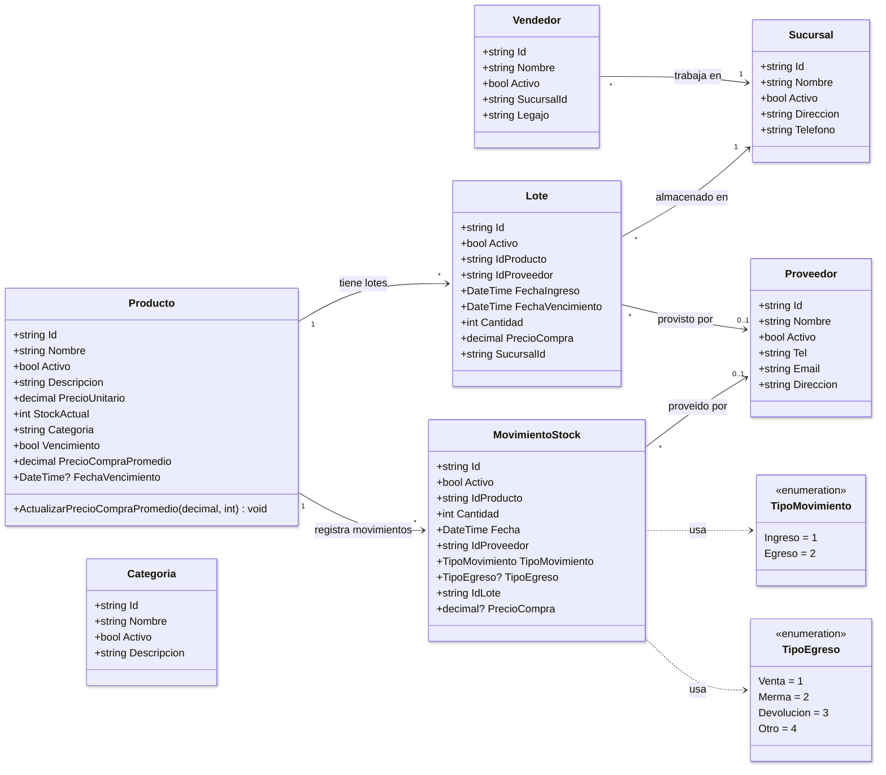
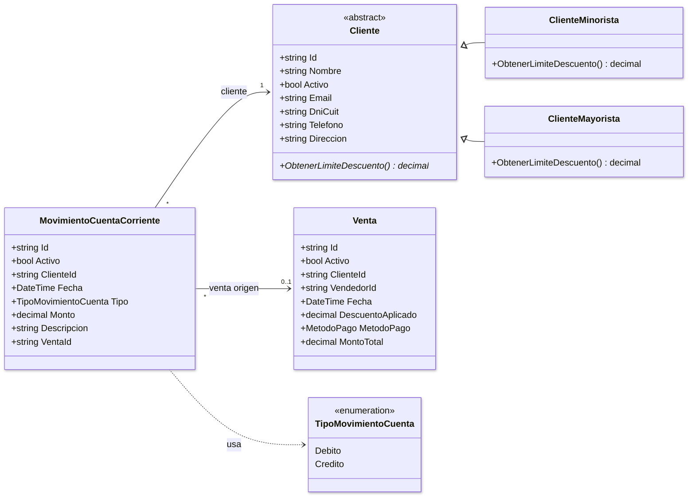

# Diagramas de Clases - Sistema de Gestion

## 1. Jerarquia de Herencia

## 2. Ventas y Clientes

## 3. Inventario y Stock

> **Nota:** `Producto.Categoria` en realidad es un `string` (nombre de la categoria), no una FK a la entidad `Categoria`. No existe relacion directa tecnicamente en el modelo EF entre ambas.

## 4. Cuenta Corriente

