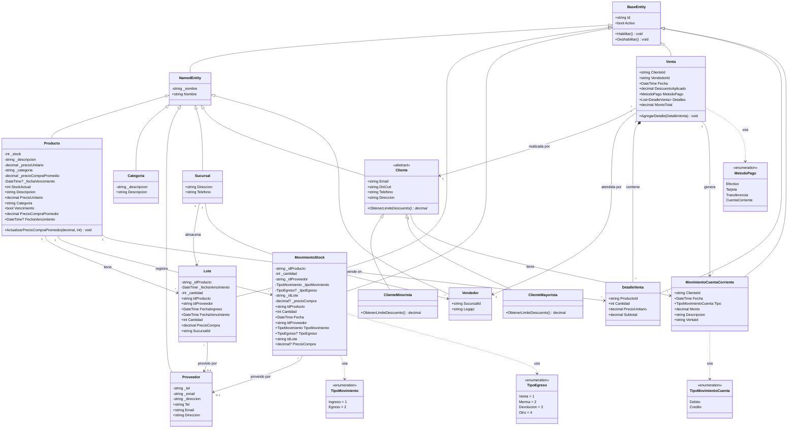

```mermaid
classDiagram
    direction TB

    %% === ENUMS ===

    class TipoMovimiento {
        <<enumeration>>
        Ingreso = 1
        Egreso = 2
    }

    class TipoEgreso {
        <<enumeration>>
        Venta = 1
        Merma = 2
        Devolucion = 3
        Otro = 4
    }

    class MetodoPago {
        <<enumeration>>
        Efectivo
        Tarjeta
        Transferencia
        CuentaCorriente
    }

    class TipoMovimientoCuenta {
        <<enumeration>>
        Debito
        Credito
    }

    %% === CLASES BASE ===

    class BaseEntity {
        +string Id
        +bool Activo
        +Habilitar() void
        +Deshabilitar() void
    }

    class NamedEntity {
        -string _nombre
        +string Nombre
    }

    %% === ENTIDADES ===

    class Producto {
        -int _stock
        -string _descripcion
        -decimal _precioUnitario
        -string _categoria
        -decimal _precioCompraPromedio
        -DateTime? _fechaVencimiento
        +int StockActual
        +string Descripcion
        +decimal PrecioUnitario
        +string Categoria
        +bool Vencimiento
        +decimal PrecioCompraPromedio
        +DateTime? FechaVencimiento
        +ActualizarPrecioCompraPromedio(decimal, int) void
    }

    class Categoria {
        -string _descripcion
        +string Descripcion
    }

    class Proveedor {
        -string _tel
        -string _email
        -string _direccion
        +string Tel
        +string Email
        +string Direccion
    }

    class Sucursal {
        +string Direccion
        +string Telefono
    }

    class Cliente {
        <<abstract>>
        +string Email
        +string DniCuit
        +string Telefono
        +string Direccion
        +ObtenerLimiteDescuento()* decimal
    }

    class ClienteMinorista {
        +ObtenerLimiteDescuento() decimal
    }

    class ClienteMayorista {
        +ObtenerLimiteDescuento() decimal
    }

    class Vendedor {
        +string SucursalId
        +string Legajo
    }

    class Lote {
        -string _idProducto
        -DateTime _fechaVencimiento
        -int _cantidad
        +string IdProducto
        +string IdProveedor
        +DateTime FechaIngreso
        +DateTime FechaVencimiento
        +int Cantidad
        +decimal PrecioCompra
        +string SucursalId
    }

    class MovimientoStock {
        -string _idProducto
        -int _cantidad
        -string _idProveedor
        -TipoMovimiento _tipoMovimiento
        -TipoEgreso? _tipoEgreso
        -string _idLote
        -decimal? _precioCompra
        +string IdProducto
        +int Cantidad
        +DateTime Fecha
        +string IdProveedor
        +TipoMovimiento TipoMovimiento
        +TipoEgreso? TipoEgreso
        +string IdLote
        +decimal? PrecioCompra
    }

    class Venta {
        +string ClienteId
        +string VendedorId
        +DateTime Fecha
        +decimal DescuentoAplicado
        +MetodoPago MetodoPago
        +List~DetalleVenta~ Detalles
        +decimal MontoTotal
        +AgregarDetalle(DetalleVenta) void
    }

    class DetalleVenta {
        +string ProductoId
        +int Cantidad
        +decimal PrecioUnitario
        +decimal Subtotal
    }

    class MovimientoCuentaCorriente {
        +string ClienteId
        +DateTime Fecha
        +TipoMovimientoCuenta Tipo
        +decimal Monto
        +string Descripcion
        +string VentaId
    }

    %% === HERENCIA ===

    BaseEntity <|-- NamedEntity
    BaseEntity <|-- Lote
    BaseEntity <|-- MovimientoStock
    BaseEntity <|-- Venta
    BaseEntity <|-- DetalleVenta
    BaseEntity <|-- MovimientoCuentaCorriente
    NamedEntity <|-- Producto
    NamedEntity <|-- Categoria
    NamedEntity <|-- Proveedor
    NamedEntity <|-- Sucursal
    NamedEntity <|-- Cliente
    NamedEntity <|-- Vendedor
    Cliente <|-- ClienteMinorista
    Cliente <|-- ClienteMayorista

    %% === ASOCIACIONES ===

    Producto "1" --> "*" Lote : tiene
    Producto "1" --> "*" MovimientoStock : registra
    Producto "1" --> "*" DetalleVenta : se vende en
    Sucursal "1" --> "*" Lote : almacena
    Sucursal "1" --> "*" Vendedor : trabaja en
    Lote "*" --> "0..1" Proveedor : provisto por
    MovimientoStock "*" --> "0..1" Proveedor : proveido por
    Venta "*" --> "1" Cliente : realizada por
    Venta "*" --> "1" Vendedor : atendida por
    Venta "1" *-- "*" DetalleVenta : contiene
    Venta "1" --> "*" MovimientoCuentaCorriente : genera
    Cliente "1" --> "*" MovimientoCuentaCorriente : tiene

    %% === USO DE ENUMS ===

    MovimientoStock ..> TipoMovimiento : usa
    MovimientoStock ..> TipoEgreso : usa
    Venta ..> MetodoPago : usa
    MovimientoCuentaCorriente ..> TipoMovimientoCuenta : usa
```
